<!-- - 👋 Hi, I’m Thomas Kwashnak, aka @LittleTealeaf
- I am currently a Computer Science major at Quinnipiac University with a double minor in Economics and Data Science.
- I love dungeons & dragons, martial arts, rubiks cubes, and learning!
 -->
 
 👋Hi, I'm Thomas Kwashnak. I'm a Bachelor of Arts Computer Science undergraduate at Quinnipiac University with a double minor in Economics and Data Science.

  
  
  

<!--- 

 

 
 

*Note, HTML is not listed as it is over-represented via javadocs. Additionally, some languages are in my repositories, however since I did not write them, I do not know them as well* --->
