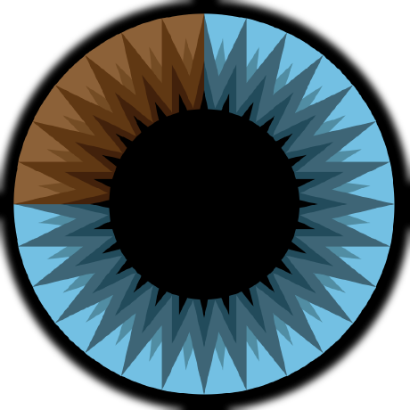

```json
{
    "name": "Thomas Kwashnak",
    "pronouns": "He/Him/His",
    "birth year": 2002,
    "education": [
        {
            "school": "Quinnipiac University",
            "status": "Undergraduate Student",
            "graduation": 2024,
            "majors": [
                "Computer Science"
            ],
            "minors": [
                "Data Science",
                "Economics"
            ]
        }
    ]
}
```
<a href="https://discord.gg/YXdv8upxag"></a> <a href="https://www.linkedin.com/in/thomas-kwashnak/"></a> <a href="https://twitter.com/LittleTeeaaa"></a>
<br>
<a href="https://github.com/dragonbite"></a> <a href="https://github.com/3b1b"></a> <a href="https://github.com/a-r-t"></a> <a href="https://github.com/swirty"></a> <a href="https://github.com/myhometoy"></a> <a href="https://github.com/BobdaFett"></a> <a href="https://github.com/Clemeit"></a> <a href="https://github.com/jjtheall"></a> <a href="https://github.com/PriscillaE1"></a> <a href="https://github.com/hle0"></a>
